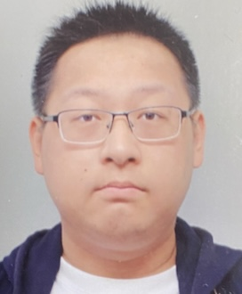

# TANG Li

    

PhD Student | System Engineer | Translator

Location: 🏯 Aizuwakamatsu, Japan

 
 

    

    

        
    

---

## Professional Summary

A highly motivated and skilled PhD student and system engineer with extensive experience in backend development and translation. Demonstrates strong leadership and communication skills through founding and leading subtitle groups. Eager to leverage expertise in IT, AI, and data analytics in innovative projects and research.

---

## Education

### PhD in Computer Science
**University of Aizu** — *Aizuwakamatsu, Japan*  
*April 2024 – Present*

- Research focus: Speech accent neutralization in aviation communication.

### Master of Computer Science
**University of Aizu** — *Aizuwakamatsu, Japan*  
*October 2019 – September 2021*

- Offline Speech Recognition System for Japanese Students Learning English as a Second Language (ESL).

### Bachelor of Science in Computer Science
**Sanjiang University** — *Nanjing, China*  
*September 2015 – June 2019*

- Graduated with a strong foundation in computer science principles and technologies.

---

## Work Experience

### System Developer
**Eyes Japan** — *Aizuwakamatsu, Japan*  
*October 2021 – Present*

- Leading development of innovative system solutions for various clients.
- Specializing in web and Android system development.
- Collaborating with cross-functional teams to deliver high-quality software products.

### Backend Developer
**Eyes Japan** — *Aizuwakamatsu, Japan*  
*February 2020 – September 2021*

- Developed and maintained backend systems for web applications.
- Implemented robust database solutions to optimize performance.

### Backend Developer
**Accenture** — *Aizuwakamatsu, Japan*  
*November 2020 – August 2021*

- Attend the development of a drone-based application designed to assist local communities.
- Collaborated with a team of developers to deliver a high-quality product.

---

## Skills

- **Technical Skills:** 
    - System Development (Web, Android)
    - Database Management
    - Cloud services
- **Programming Languages:** 
    -  Python
    -  C++
    -  JavaScript
    -  PHP
    -  SQL
    -  Kotlin
    -  Java
    -  HTML
    -  CSS
    -  Markdown
    -  LaTeX
    -  MATLAB
    -  Ruby
    -  WordPress
- **Languages** 
    -  Chinese (Native)
    -  English (Advanced)
    -  Japanese (Intermediate)
- **Certifications** 
    -  Microsoft Security, Compliance, and Identity Fundamentals

---

## Leadership and Volunteering

### Founder & Leader
**BlueBloods Subtitle Group**  

*Role:* Leader, Translator, Proofreader

- Founded and managed a subtitle group focused on producing high-quality translations.
- Coordinated with team members to meet project deadlines and maintain translation standards.
- Translated and proofread subtitles for various TV shows and movies, over 150 episodes, such as "Blue Bloods", "Unforgettable", "Legends“, "3 Hours: The Secret Soldiers of Benghazi".

### Group Leader
**GA Subtitle Group**  

*Role:* Leader, Translator, Proofreader

- Led a team of translators and proofreaders in producing accurate subtitles.
- Oversaw project progress and ensured timely delivery of translation projects.
- Translated and proofread subtitles for various TV shows, "NCIS New Orleans".

---

## Achievements

- **ハードニングプロジェクト – Hardening Projec 2021** — Winner
  - Secured first place in a cybersecurity competition with team members, showcasing advanced knowledge and skills in system hardening.

- **JAXA Aviation Innovation Challenge 2024**
  - Participating in a high-profile innovation challenge focused on advancements in aviation technology.

---

## Publications & Patents

- **Journal Papers:** *(To be updated)*
- **Conference Papers:** *(To be updated)*
- **Book Chapters:** *(To be updated)*
- **Patents:** *(To be updated)*

---

## Projects

### Obihiro FM Radio Station
A web and LINEbot application developed to assist the local community in publishing advertisements to the FM radio station.

- **Technologies Used:** 
        
- **Role:** 
Project Leader, Solution Provider, Backend Developer, and Front-End Contributor.

[Link to the project](https://communityfm.jp/)

### AI-Based Patient Illness Assessment System
A healthcare application utilizing AI to assess and diagnose patient illnesses.

- **Technologies Used:** 
     
- **Role:** 
Solution Provider, Backend Developer, Database Architect, API Developer

---

## Future Plans

### Research Plan
- Focus on developing techniques for speech accent neutralization in aviation communication.

### Education Plan
- Successfully complete my PhD at the University of Aizu and continue to contribute to innovative research and technology development.

### Career Plan
- Work as a research in industry or corporate research lab related to aviation communication and speech recognition.
- Work and travel overseas to gain international experience and expand my professional network.

---
<!-- 
*This CV was created using Markdown language. It can be easily converted to PDF or other formats using various tools.* -->
